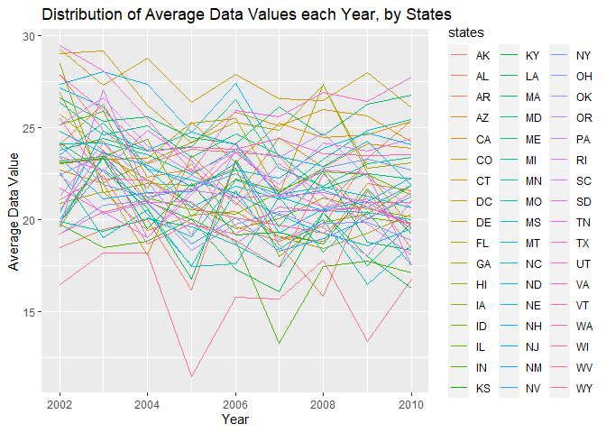

p8105\_hw3\_ar4173
================
Anand Rajan
10/17/2021

## Problem 1

Importing and Examining Dataset

``` r
library(p8105.datasets)
data("instacart")

instacart
## # A tibble: 1,384,617 x 15
##    order_id product_id add_to_cart_order reordered user_id eval_set order_number
##       <int>      <int>             <int>     <int>   <int> <chr>           <int>
##  1        1      49302                 1         1  112108 train               4
##  2        1      11109                 2         1  112108 train               4
##  3        1      10246                 3         0  112108 train               4
##  4        1      49683                 4         0  112108 train               4
##  5        1      43633                 5         1  112108 train               4
##  6        1      13176                 6         0  112108 train               4
##  7        1      47209                 7         0  112108 train               4
##  8        1      22035                 8         1  112108 train               4
##  9       36      39612                 1         0   79431 train              23
## 10       36      19660                 2         1   79431 train              23
## # ... with 1,384,607 more rows, and 8 more variables: order_dow <int>,
## #   order_hour_of_day <int>, days_since_prior_order <int>, product_name <chr>,
## #   aisle_id <int>, department_id <int>, aisle <chr>, department <chr>
```

From opening the dataset, we see there are 1,384,617 observations
described by 15 variables. The dataset groups products ordered by their
order id, while having their own separate product id. Moreover, the
dataset shows the day of the week(order\_dow) and the hour of day the
product was ordered. Finally we see in the dataset from which aisle and
department each product is located in, each product has an associated
product name.

``` r
instacart_df =
  instacart %>% 
  group_by(aisle) %>% 
  summarize(items_ordered =n()) %>% 
  arrange(desc(items_ordered)) %>% 
  mutate(
    aisle_rank=order(items_ordered,decreasing=TRUE)
  )
```

To see the number of aisles and the items ordered from each isle, I
created a new dataframe that uses the group\_by function. From this
dataframe we see that there are 134 aisles. Furthermore, the aisles that
had the most items ordered from were “fresh vegetables”, “fresh fruits”,
“package vegetables fuits”.

``` r
instacart_plot_data = 
  instacart_df %>% 
  filter(items_ordered > 10000)

instacart_plot =
  ggplot(instacart_plot_data, aes(x= aisle_rank , items_ordered)) + geom_point(aes(color=aisle)) + 
  labs(
    title = "Number of Items Ordered vs. Aisle rank",
    x= "Aisle Rank",
    y= "Number of Items Ordered"
  )

instacart_plot
```

<!-- -->

``` r
ggsave("instacart_plot.pdf", instacart_plot, width=8, height=5)
```

In the plot above, I have created a new variable called aisle rank which
ranks aisles based on the number of items ordered from that specific
aisle. The higher the aisle rank the less amount of items were ordered
from that aisle. Moreover, the aisles displayed are only the aisles that
had over 10,000 items ordered from them. As we can see from the plot,
there is a clear disparity of the top two aisles (fresh vegetables and
fresh fruit) from the rest of the aisles.

``` r
popular_items =
  instacart %>%
  filter(
    aisle %in% c("baking ingredients", "dog food care", "packaged vegetables fruits")
  ) %>% 
  group_by(aisle) %>% 
  count(product_name, name="order_count") %>% 
  mutate(
    product_rank = min_rank(desc(order_count))
  ) %>% 
  filter(product_rank <= 3) %>% 
  group_by(aisle) %>%
    arrange(product_rank, .by_group = TRUE) %>% 
  select(-product_rank) 


knitr::kable(popular_items, 
            format="simple", 
            col.names=str_to_title(names(popular_items)))
```

| Aisle                      | Product\_name                                 | Order\_count |
|:---------------------------|:----------------------------------------------|-------------:|
| baking ingredients         | Light Brown Sugar                             |          499 |
| baking ingredients         | Pure Baking Soda                              |          387 |
| baking ingredients         | Cane Sugar                                    |          336 |
| dog food care              | Snack Sticks Chicken & Rice Recipe Dog Treats |           30 |
| dog food care              | Organix Chicken & Brown Rice Recipe           |           28 |
| dog food care              | Small Dog Biscuits                            |           26 |
| packaged vegetables fruits | Organic Baby Spinach                          |         9784 |
| packaged vegetables fruits | Organic Raspberries                           |         5546 |
| packaged vegetables fruits | Organic Blueberries                           |         4966 |

The table above shows the three most popular items ordered in each of
the following aisles: “baking ingredients”, “dog food care”, and “packed
vegetables fruits”. As we can see from the table, among baking
ingredients the most popular item is light brown sugar. In the aisle
“dog food care”, the most popular item is snack sticks. Finally in the
aisle “packed vegetables fruits”, the most popular item is Organic Baby
Spinach. Furthermore this table shows us that the order count of the
most popular items from each of the aisles vastly differs between aisle
to aisle.

``` r
order_hour =
  instacart %>% 
  mutate(
    order_dow = recode(order_dow, 
                       "0"="Sunday", 
                       "1"="Monday", 
                       "2"="Tuesday", 
                       "3"="Wednesday", 
                       "4"="Thursday", 
                       "5"="Friday", 
                       "6"="Saturday")
  ) %>% 
  group_by(product_name, order_dow) %>%
  filter(
    product_name %in% c("Pink Lady Apples","Coffee Ice Cream")) %>% 
  summarize(mean_hour=(mean(order_hour_of_day))) %>% 
  mutate(
    day_of_the_week=ordered(order_dow,c("Sunday","Monday","Tuesday","Wednesday","Thursday","Friday","Saturday"))
  ) %>% 
  arrange(day_of_the_week) %>% 
  select(-order_dow) %>% 
  pivot_wider(
    names_from="day_of_the_week",
    values_from="mean_hour"
  )


knitr::kable(order_hour,
             format="simple", 
            col.names=str_to_title(names(order_hour))
            )
```

| Product\_name    |   Sunday |   Monday |  Tuesday | Wednesday | Thursday |   Friday | Saturday |
|:-----------------|---------:|---------:|---------:|----------:|---------:|---------:|---------:|
| Coffee Ice Cream | 13.77419 | 14.31579 | 15.38095 |  15.31818 | 15.21739 | 12.26316 | 13.83333 |
| Pink Lady Apples | 13.44118 | 11.36000 | 11.70213 |  14.25000 | 11.55172 | 12.78431 | 11.93750 |

The table above shows the mean hour of day(military time-hour) at which
Pink Lady Apples and Coffee Ice cream were ordered throughout the week.
During the week, Monday through Thursday, coffee ice cream was ordered
at a later hour as opposed to the weekend. However, we did not observe
such trend for the hour at which Pink Lady Apples were purchased.
Furthermore, by comparing the distributions throughout the week, it
seems that the average hour of the day at which coffee ice cream is
ordered is later than the hour at which pink lady apples are.

## Problem 2

Importing and Cleaning BRFSS Dataset

``` r
data("brfss_smart2010")

health_brfss=
force(brfss_smart2010) %>% 
  janitor::clean_names() %>% 
  filter(topic=="Overall Health" ) %>% 
  filter(response %in% c("Poor","Fair","Good","Very Good","Excellent")) %>% 
  mutate(
    response = 
      recode(
        response,
        "Poor" = "1",
        "Fair" = "2",
        "Good" = "3",
        "Very Good" = "4",
        "Excellent" = "5"
      ) 
  ) %>% 
  arrange((response)) %>% 
  mutate(
    response = recode(
      response,
        "1" = "Poor",
        "2" = "Fair",
        "3" = "Good",
        "4" = "Very Good",
        "5" = "Excellent",
    )
  ) %>% 
  rename(
    states= locationabbr,
    county= locationdesc
  ) %>% 
  drop_na(data_value)
```

``` r
states_2002 =
health_brfss %>%
  filter(year==2002) %>%
  group_by(states) %>% 
  summarize(location_count = n()) %>% 
  filter(location_count>=7)

knitr::kable(states_2002,
             format="simple", 
            col.names=str_to_title(names(states_2002)),
            caption = "States Observed at 7 or More Locations in 2002"
            )
```

| States | Location\_count |
|:-------|----------------:|
| AZ     |               8 |
| CO     |              16 |
| CT     |              28 |
| DE     |              12 |
| FL     |              28 |
| GA     |              12 |
| HI     |              16 |
| ID     |               8 |
| IL     |              12 |
| IN     |               8 |
| KS     |              12 |
| LA     |              12 |
| MA     |              32 |
| MD     |              24 |
| ME     |               8 |
| MI     |              16 |
| MN     |              16 |
| MO     |               8 |
| NC     |              28 |
| NE     |              12 |
| NH     |              20 |
| NJ     |              24 |
| NV     |               8 |
| NY     |              20 |
| OH     |              16 |
| OK     |              12 |
| OR     |              12 |
| PA     |              40 |
| RI     |              16 |
| SC     |              12 |
| SD     |               8 |
| TN     |               8 |
| TX     |               8 |
| UT     |              20 |
| VT     |              12 |
| WA     |              16 |

States Observed at 7 or More Locations in 2002

The table above shows 36 states were observed at 7 or more locations in
2002.

``` r
states_2010 =
health_brfss %>%
  filter(year==2010) %>%
  group_by(states) %>% 
  summarize(location_count = n()) %>% 
  filter(location_count>=7)

knitr::kable(states_2010,
             format="simple", 
            col.names=str_to_title(names(states_2002)),
            caption = "States Observed at 7 or More Locations in 2010"
            )
```

| States | Location\_count |
|:-------|----------------:|
| AL     |              12 |
| AR     |              12 |
| AZ     |              12 |
| CA     |              48 |
| CO     |              28 |
| CT     |              20 |
| DE     |              12 |
| FL     |             161 |
| GA     |              16 |
| HI     |              16 |
| IA     |               8 |
| ID     |              24 |
| IL     |               8 |
| IN     |              12 |
| KS     |              16 |
| LA     |              20 |
| MA     |              36 |
| MD     |              48 |
| ME     |              24 |
| MI     |              16 |
| MN     |              20 |
| MO     |              12 |
| MS     |               8 |
| MT     |              12 |
| NC     |              48 |
| ND     |              12 |
| NE     |              40 |
| NH     |              20 |
| NJ     |              76 |
| NM     |              24 |
| NV     |               8 |
| NY     |              36 |
| OH     |              32 |
| OK     |              12 |
| OR     |              16 |
| PA     |              28 |
| RI     |              20 |
| SC     |              28 |
| SD     |               8 |
| TN     |              20 |
| TX     |              63 |
| UT     |              24 |
| VT     |              24 |
| WA     |              40 |
| WY     |               8 |

States Observed at 7 or More Locations in 2010

The table above shows 45 states were observed at 7 or more locations in
2010.

``` r
mean_data = 
health_brfss %>%
  filter(response=="Excellent") %>% 
  drop_na(data_value) %>% 
  group_by(states,year) %>% 
  mutate(
    avg_data_value=mean(data_value)
  ) %>% 
  select(year,states,avg_data_value) %>% 
  distinct()

spaghetti_plot = 
ggplot(mean_data, aes(x=year, y=avg_data_value, color=states)) +geom_line(se=FALSE) +
    labs(
    title = "Distribution of Average Data Values each Year, by States",
    x= "Year",
    y= "Average Data Value"
  )
## Warning: Ignoring unknown parameters: se
spaghetti_plot
```

<!-- -->

``` r
ggsave("spaghetti_plot.pdf", spaghetti_plot, width=8, height=5)
```

The spaghetti plot above shows the distribution of average data values
throughout the years for each state. Among most of the states throughout
the years, the average data value is between 20 and 25.

``` r
ny_boxplot =
health_brfss %>% 
  filter(year== "2006" | year=="2010" , states=="NY") %>%
  ggplot(aes(x=response, y= data_value, color= response)) + geom_boxplot() +
  facet_grid(.~year) +
  labs(
    title = "Distribution of Data Values for 2006 and 2010 in NY, by responses",
    x= "Response",
    y= "Data Value"
  )

ny_boxplot
```

<!-- -->

``` r
ggsave("ny_boxplot.pdf", ny_boxplot, width=8, height=5)
```

The boxplot shows the distribution of data values for each response
level in 2006 and 2010, in New York. In 2006, we can see that the data
values are highest in the “Good” response level, while the lowest data
values are in the “Poor” response level. We see a similar trend in 2010.
Moreover the highest range of data values is in the “Good” Response
level.

## Problem 3

Import Acceleration Data

``` r
accel_df = 
  read.csv("./data/accel_data.csv") %>% 
  janitor::clean_names()
```

Tidying and Analzying Data

``` r
accel_tidy =
  accel_df %>% 
  pivot_longer (
    activity_1:activity_1440,
    names_to = "minute",
    names_prefix = "activity_",
    values_to= "activity_count") %>% 
  mutate(
    week = as.integer(week),
    day_id=as.integer(day_id),
    minute = as.integer(minute),
    hour = as.integer(minute %/% 60),
    day = factor(day, levels = c("Sunday", "Monday","Tuesday","Wednesday","Thursday","Friday","Saturday")),
    weekday_vs_weekend = 
      case_when(
        day %in% c("Monday", "Tuesday","Wednesday","Thursday", "Friday") ~ "weekday",
        day %in% c("Saturday", "Sunday") ~ "weekend")) 
```

The tidy data set has 50,400 observations described by 7 variables, thus
there are 7 Columns and 50,400 rows.The variables are minute, hour, day,
and week. Furthermore it shows the activity count as well.

``` r
total_activity_count =
accel_tidy %>% 
  group_by(day) %>% 
  summarize(total_activity= sum(activity_count, na.rm=TRUE)) 

knitr::kable(total_activity_count,
  caption =
    "Total Activity Count per Day")
```

| day       | total\_activity |
|:----------|----------------:|
| Sunday    |         1919213 |
| Monday    |         1858699 |
| Tuesday   |         1799238 |
| Wednesday |         2129772 |
| Thursday  |         2091151 |
| Friday    |         2291711 |
| Saturday  |         1369237 |

Total Activity Count per Day

From analyzing the table, we see that activity count is much higher on
Wednesday through Friday as opposed to the rest of the week.
Furthermore, the activity count on Saturday is much lower compared to
the activity count for the rest of the week.

``` r
accelerometer_plot=
accel_tidy %>%
  group_by(day,minute) %>%
  ggplot(aes(x=minute, y=activity_count, color=day)) +
  geom_point() +
  labs(
    title= "Activity Time Per Day",
    x="Hour of the Day",
    y="Activity Count"
    ) +
  scale_x_continuous(
    breaks= c(0,240,480,720,960,1200,1440),
    labels = c("0 hour","4 hour","8 hour","12 hour","16 hour","20 hour","24 hour"))

accelerometer_plot
```

<!-- -->

``` r
ggsave("accelerometer_plot.pdf", accelerometer_plot, width=8, height=5)  
```

There are a few patterns we can glean from this plot. For one, activity
count is higher in the middle of the day(12 hour to 16 hour mark) as
opposed to weekdays. Meanwhile on Fridays, activity count looks highest
late in the day or the evening time. Moreover there seems to be high
activity counts on Thursday mornings, whereas on Tuesdays there is
activity count late in the evenings as well. Finally for Wendesdays, the
activity count seems evenly distributed throughout the day.
